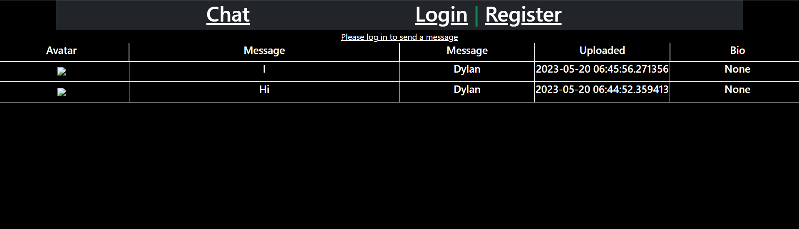

# Error Handling
> This Project was about learning how to add error pages

> BreakDown of this project:

> In this project i learned how to add error pages when an error has occured

> What was used in this project:
* html
* flask
* bootstrap
* css
> home page

> login page

> register page

> error page
